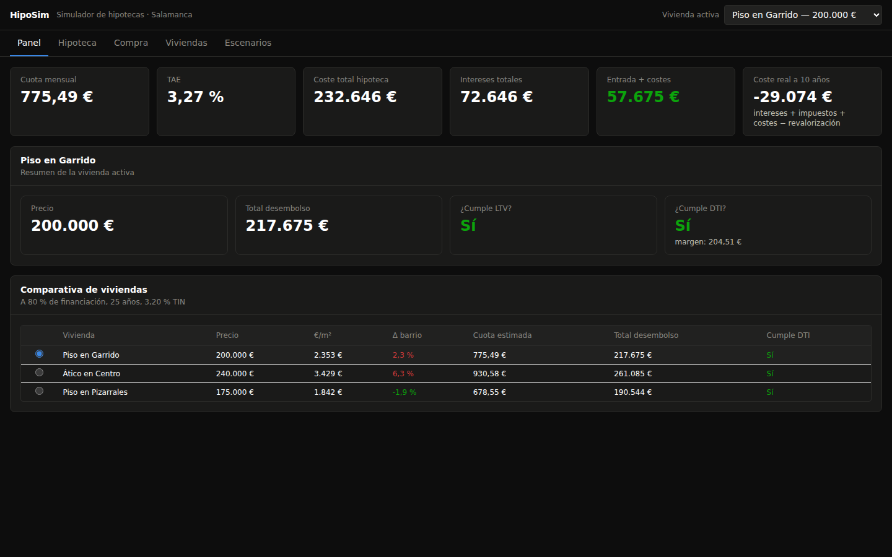
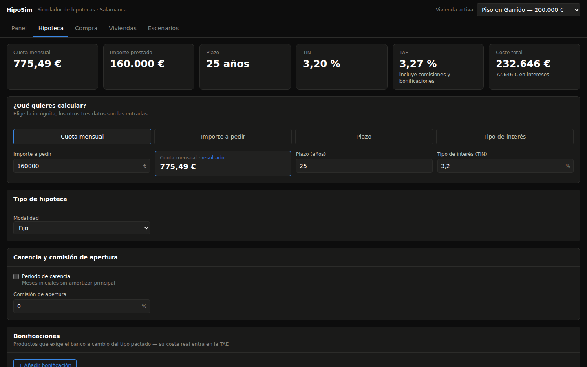
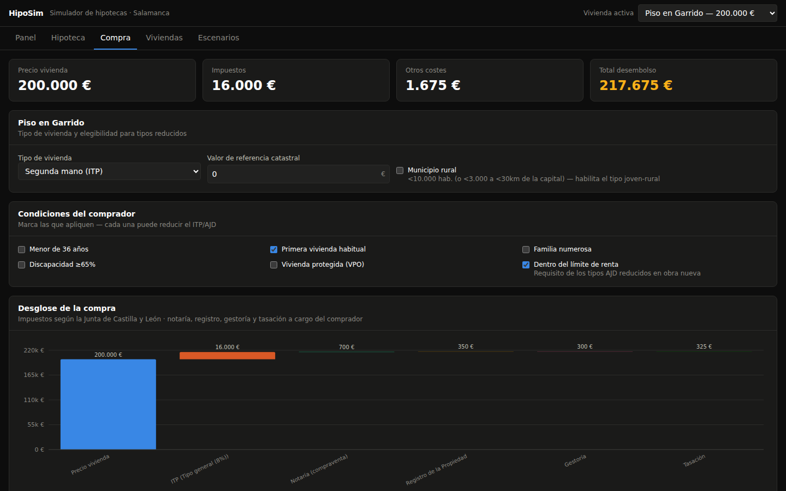
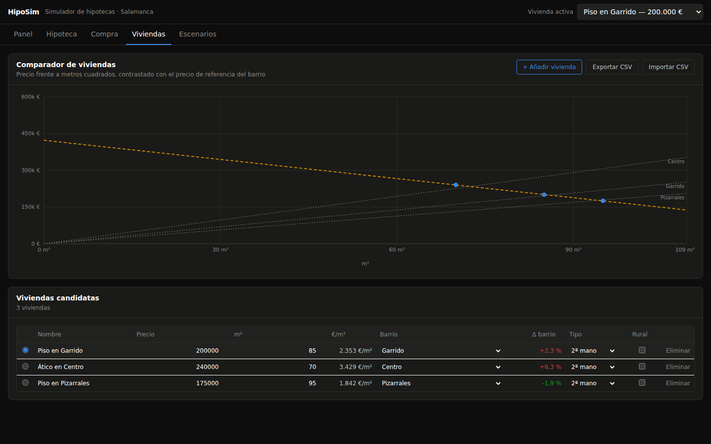
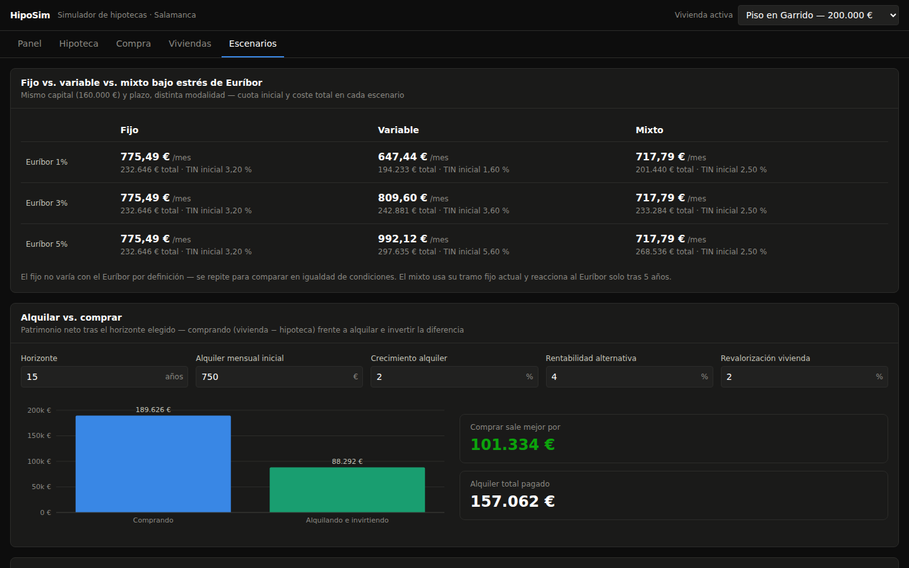

<p align="center">
  
</p>

# HipoSim

**Simulador de hipotecas y de compra de vivienda en Salamanca**, Castilla y León. Desktop app para Windows y macOS — explora hipotecas, calcula el coste real de comprar una casa (impuestos, notaría, registro, tasación), y compara precios frente a metros cuadrados por barrio, todo en un panel denso pensado para analizar, no solo para mirar.

Construida con [Tauri v2](https://v2.tauri.app/) + React + TypeScript. El motor de cálculo es TypeScript puro, con 101 tests que lo verifican contra los valores exactos de una hoja de cálculo de referencia y contra los tipos fiscales publicados por la Junta de Castilla y León.



---

## Índice

- [Qué hace](#qué-hace)
- [Capturas de pantalla](#capturas-de-pantalla)
- [Stack técnico](#stack-técnico)
- [Empezar a desarrollar](#empezar-a-desarrollar)
- [Tests](#tests)
- [Compilar la app de escritorio](#compilar-la-app-de-escritorio)
- [Estructura del proyecto](#estructura-del-proyecto)
- [Fuentes de datos y avisos](#fuentes-de-datos-y-avisos)
- [Limitaciones conocidas](#limitaciones-conocidas)

---

## Qué hace

**Panel** — vista de conjunto: cuota, TAE, coste total, entrada necesaria, veredicto de asequibilidad (LTV/DTI) y una tabla comparativa de todas las viviendas candidatas a tus condiciones de financiación.

**Hipoteca** — el simulador. Elige qué quieres calcular (**capital, cuota, plazo o tipo de interés**) a partir de los otros tres — incluida tu petición original: fija la cuota mensual y descubre cuánto puedes pedir prestado y cómo se reparte el primer pago entre principal e intereses. Soporta hipoteca fija, variable (Euríbor + diferencial, con revisiones periódicas) y mixta; carencia total o parcial; y un simulador de amortización anticipada (pagos únicos o recurrentes, en modo *reducir cuota* o *reducir plazo*) que muestra los intereses ahorrados y el límite legal de comisión por amortización anticipada (Ley 5/2019).

**Compra** — el desglose de comprar una vivienda concreta en Castilla y León: ITP (segunda mano) o IVA+AJD (obra nueva), con los tipos reducidos por edad, familia numerosa, discapacidad, VPO o municipio rural aplicados en vivo; más notaría, registro, gestoría y tasación. Respeta la Ley 5/2019: los gastos de la hipoteca (notaría, registro, gestoría, AJD) los paga el banco, no tú — muchas calculadoras online todavía se equivocan en esto.

**Viviendas** — el comparador. Tabla editable de viviendas candidatas con importación/exportación CSV, y un gráfico de dispersión precio-vs-m² con líneas de referencia por barrio de Salamanca, para ver de un vistazo si un piso está caro o barato para su zona.

**Escenarios** — fijo vs. variable vs. mixto bajo estrés de Euríbor (1%/3%/5%); alquilar vs. comprar (invirtiendo la diferencia); cuánto tardarías en ahorrar la entrada; y un mapa de calor de sensibilidad plazo × tipo de interés.

## Capturas de pantalla

| Hipoteca | Compra |
|---|---|
|  |  |

| Viviendas | Escenarios |
|---|---|
|  |  |

## Stack técnico

| Pieza | Elección | Por qué |
|---|---|---|
| Shell de escritorio | [Tauri v2](https://v2.tauri.app/) | Instalador nativo ~8 MB (frente a ~100 MB de Electron); el lado Rust es la plantilla por defecto sin tocar — toda la lógica vive en TypeScript |
| UI | React 19 + TypeScript + Vite | — |
| Estado | [Zustand](https://github.com/pmndrs/zustand) | Store mínimo con solo *inputs*; todo lo demás se deriva con selectores puros (`src/store/selectors.ts`) — imposible que un gráfico y una tabla se desincronicen |
| Gráficos | [Recharts](https://recharts.org/) + SVG a medida (mapa de calor, waterfall) | Paleta y especificaciones de marca validadas con la skill `dataviz` (contraste, daltonismo) |
| Estilos | Tailwind CSS v4 | Tema oscuro único, sin alternancia claro/oscuro (app de escritorio, no un artefacto compartible) |
| Tests | Vitest | Solo `src/core/` — el motor se prueba a fondo; la UI no tiene tests unitarios |
| Persistencia | `zustand/middleware persist` con un adaptador de storage propio | Escribe en el directorio de datos de la app vía `@tauri-apps/plugin-fs`; usa `localStorage` como *fallback* cuando se ejecuta como web app (`vite dev`) |

La propiedad clave del diseño: **la app es una web app pura que Tauri envuelve**. Nada de la lógica de negocio depende de Tauri, así que todo se desarrolla y prueba con `vite dev` en un navegador normal — el shell nativo entra en juego solo al empaquetar.

## Empezar a desarrollar

```bash
npm install
npm run dev          # abre http://localhost:1420 en el navegador — no requiere toolchain nativo
```

Todo el motor de cálculo vive en `src/core/`, es TypeScript puro y no tiene ninguna dependencia de Tauri — se puede desarrollar, depurar y probar íntegramente como una web app.

Para ejecutar como app de escritorio nativa necesitas los [prerrequisitos de Tauri](https://v2.tauri.app/start/prerequisites/) para tu sistema operativo (ver la sección de compilación más abajo):

```bash
npm run tauri dev
```

## Tests

```bash
npm test              # ejecuta la suite una vez
npm run test:watch    # modo watch
npx tsc --noEmit       # comprobación de tipos, sin emitir nada
```

101 tests cubren `src/core/`: valores dorados verificados contra la hoja de cálculo de referencia (`Calculadora de préstamos simple y tabla de amortización.xlsx`), *round-trips* del solver de 4 vías, cierre exacto del cuadro de amortización (fijo/variable/mixto, carencia, amortización anticipada), los tramos del ITP de Castilla y León, y la separación de gastos de la Ley 5/2019.

## Compilar la app de escritorio

Guía detallada, paso a paso, para Windows y macOS: **[docs/BUILDING.md](docs/BUILDING.md)**.

Resumen rápido — la vía recomendada es dejar que la Integración Continua compile por ti, porque **un instalador de macOS solo se puede generar en macOS, y uno de Windows lo más fiable es generarlo en Windows**, sea cual sea tu máquina de desarrollo:

```bash
git tag v0.1.0
git push origin v0.1.0
```

Esto dispara `.github/workflows/release.yml`: compila en runners `windows-latest` y `macos-latest` (Intel + Apple Silicon) y adjunta los instaladores (`.msi`/`.exe` y `.dmg`) a un GitHub Release en borrador. `docs/BUILDING.md` cubre también la compilación 100% local en cada sistema operativo, por si prefieres no depender de CI.

## Estructura del proyecto

```
src/core/                 motor de cálculo puro — probado exhaustivamente, sin UI ni Tauri
  finance.ts                 primitivas financieras (equivalentes a PMT/IPMT/PPMT/PV/NPER/RATE/IRR de Excel)
  solve.ts                    el solver de 4 vías: resuelve capital, cuota, plazo o tipo a partir de los otros tres
  schedule.ts                 cuadro de amortización — fijo/variable/mixto, carencia, amortización anticipada
  tae.ts                       TAE real vía TIR, incluyendo comisiones y coste de bonificaciones
  property.ts                  €/m², comparación con el barrio, coste total de propiedad (TCO)
  rentbuy.ts                   alquilar vs. comprar (modelo "alquila e invierte la diferencia")
  spain/costs.ts               ITP/IVA/AJD de Castilla y León, notaría/registro/gestoría/tasación
  spain/limits.ts              LTV, DTI, comisiones máximas de amortización anticipada (Ley 5/2019)
src/data/salamanca.ts     precios de referencia por barrio (idealista, mayo 2026)
src/store/
  types.ts                     tipos del estado (solo inputs)
  defaults.ts                   valores iniciales — vivienda de ejemplo en Garrido incluida
  useAppStore.ts                store Zustand + persistencia
  selectors.ts                  toda la lógica derivada — hooks que componen el motor con el estado
src/ui/
  components/                  Card, StatTile, campos de formulario reutilizables
  tabs/                        las 5 pestañas: Panel, Hipoteca, Compra, Viviendas, Escenarios
src-tauri/                 shell nativo de Tauri (Rust) — ventana, filesystem, empaquetado
.github/workflows/
  ci.yml                        tests + typecheck en cada push/PR
  release.yml                   instaladores Windows/macOS al crear un tag
```

Documentación más detallada de la arquitectura del motor y el patrón store/selectores: **[docs/ARCHITECTURE.md](docs/ARCHITECTURE.md)**.

## Fuentes de datos y avisos

- **Impuestos**: tipos de ITP/IVA/AJD verificados contra las tablas publicadas por la [Junta de Castilla y León](https://tributos.jcyl.es/) a fecha de agosto de 2026 (constante `RATES_AS_OF` en `src/core/spain/costs.ts`). Los tipos reducidos de AJD (0,5% / 0,01%) llevan límites de renta que la app no modela con su valor exacto — revísalos en `tributos.jcyl.es` antes de una decisión real.
- **Precios de mercado**: precios por barrio de Salamanca capital, idealista, cierre de mayo 2026 (constante `SALAMANCA_DATA_AS_OF` en `src/data/salamanca.ts`). El alquiler no tiene desglose por barrio publicado — se usa la media de la capital como aproximación, editable.
- **Euríbor**: sembrado con la media de agosto de 2026 (2,95%), editable en la pestaña Hipoteca.
- Esto es un simulador, **no asesoramiento fiscal ni financiero**.

## Limitaciones conocidas

- **Compilación nativa en esta máquina de desarrollo**: si tu Linux carece de `webkit2gtk`/`libdbus-1-dev`, `npm run tauri dev` no compilará el shell nativo — es una carencia de bibliotecas de sistema Linux, no del código, y no afecta a Windows ni macOS (backends nativos completamente distintos, sin dependencia de dbus/gtk). Ver [docs/BUILDING.md](docs/BUILDING.md#linux-como-entorno-de-desarrollo).
- Firma de código ad-hoc por defecto (macOS), sin certificado de Developer ID ni notarización: macOS mostrará un aviso de Gatekeeper ("no se pudo verificar el desarrollador") y Windows uno de SmartScreen la primera vez, salvo que configures certificados de firma real (ver `docs/BUILDING.md`).
